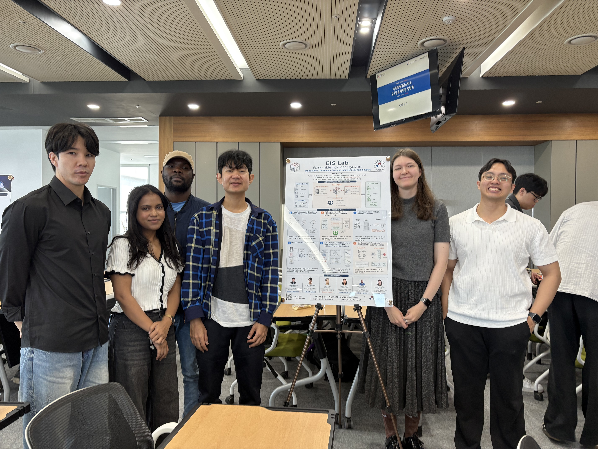

[← Back to gallery](../index.qmd)

::: {.photo-grid}
{group="lab-life"}
:::

::: {.photo-grid}
.jpg){group="lab-life"}
:::

::: {.photo-grid}
{group="lab-life"}
:::

<!--
==========================================================
HOW TO ADD PHOTOS TO THIS ALBUM
1. Drop image files into this folder (gallery/lab-life/).
2. Delete the "Photos coming soon" line above.
3. Add one line per photo inside the photo-grid below,
   using the lightbox group so photos open as a slideshow:

::: {.photo-grid}
{group="lab-life"}
{group="lab-life"}
{group="lab-life"}
:::

That's it — Quarto generates the grid and the lightbox.
==========================================================
-->
