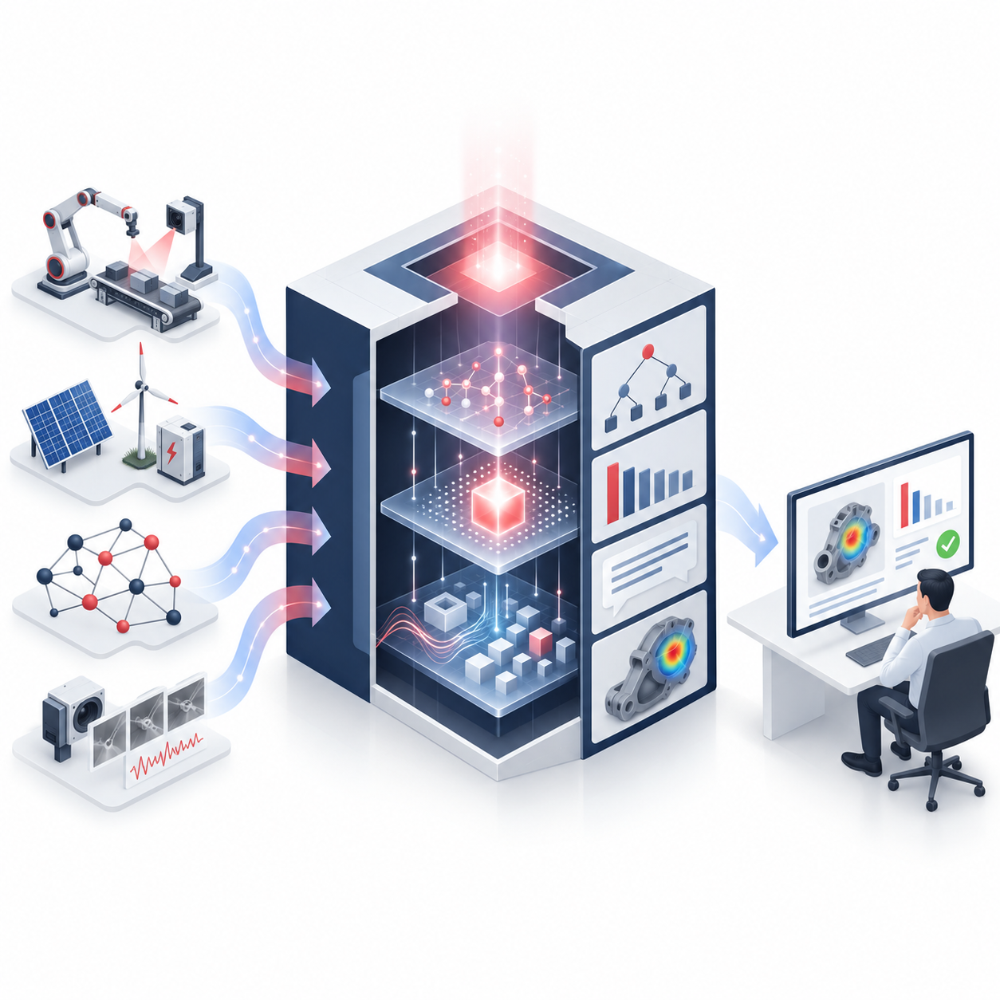

::: {.hero-split}
::: {.hero-text}

Explainable Intelligent Systems Lab · SeoulTech

# Explainable AI for Intelligent Decision Support

We develop explainable and human-centered AI methods for reliable decision support across complex real-world domains.

<a class="btn-eis" href="research.qmd">Our research</a>
<a class="btn-eis-outline" href="people/index.qmd">Meet the lab</a>
:::
::: {.hero-art}
<!-- {fig-alt="EIS Lab cube logo"} -->
{fig-alt="EIS hero figure"}
:::
:::

What we do

## Research directions



<!--
TO ADD A PILLAR CARD: copy any <a class="pillar-card">...</a> block
above (inside the html block). The grid adapts automatically to any
number of cards — 3, 4, 5... no other change needed.
Note: links inside this raw block must use .html, not .qmd.
-->

About us

## The lab

The Explainable Intelligent Systems (EIS) Lab at Seoul National University of Science and Technology develops explainable and human-centered AI methods for industrial and energy systems. Our research combines interpretable machine learning, AI-generated explanations, process-aware analytics, and predictive modeling for manufacturing quality, solar power forecasting, and battery health estimation.

We aim to create AI systems that are not only accurate, but also understandable, trustworthy, and useful for decision-making — bridging methodological research in explainable AI with practical decision-support problems in smart manufacturing and sustainable energy.

Latest

## News

::: {#latest-news}
:::

<a href="news/index.qmd">All news →</a>

