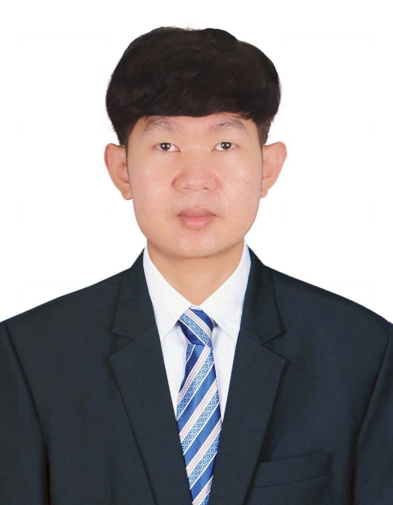
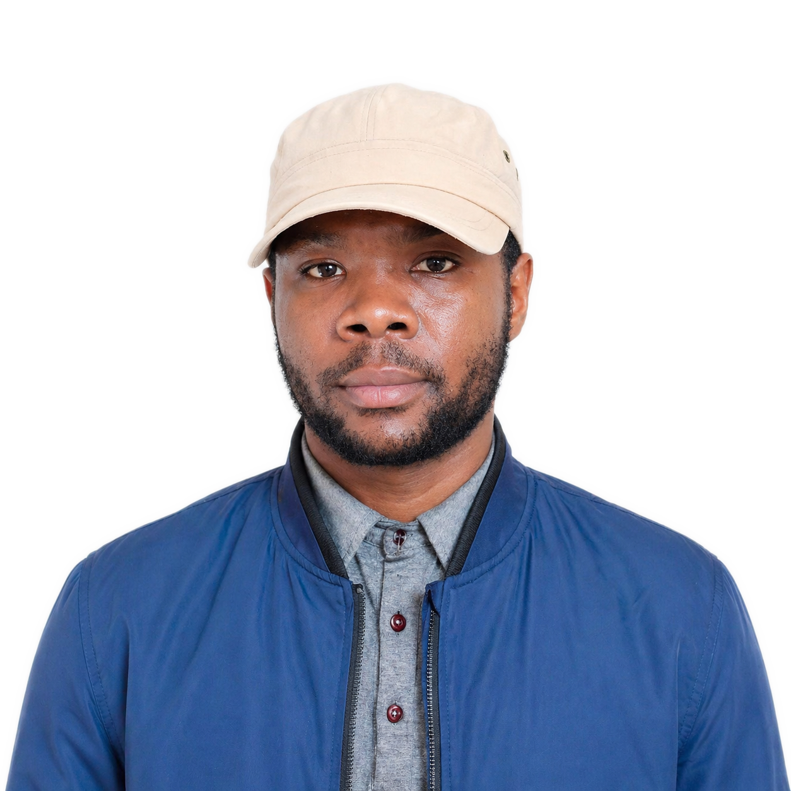
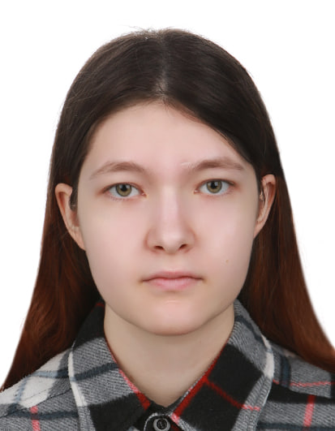
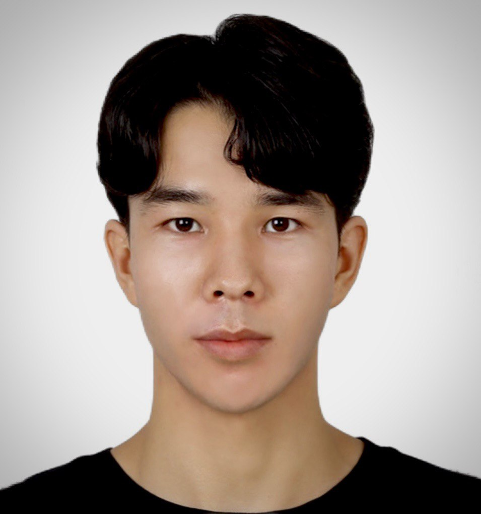
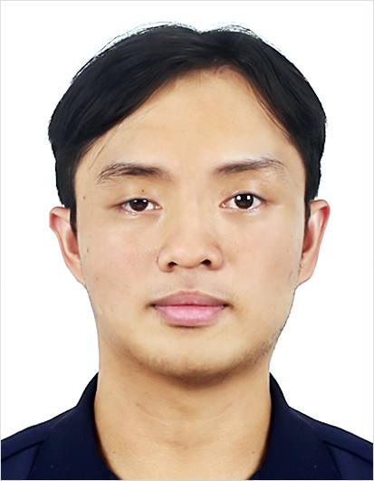

<!-- AUTO-GENERATED: edit _data/people.yml, not this file. -->

## PhD Students

::: {.member-grid}
::: {.member-card}
{.member-photo fig-alt="Portrait of Raksmey Pahn"}

Raksmey Pahn

PhD Student · since Sep 2025

Battery SOHXAI

<a href="https://github.com/tuyvanak" aria-label="GitHub" title="GitHub"><i class="bi bi-github"></i></a>

:::

:::

## Master's Students

::: {.member-grid}
::: {.member-card}
{.member-photo fig-alt="Portrait of Makweya Tobias"}

Makweya Tobias

Master's Student · since Sep 2025

XAI for GNNs

<a href="https://github.com/MakweyaTobias" aria-label="GitHub" title="GitHub"><i class="bi bi-github"></i></a>

:::

::: {.member-card}
{.member-photo fig-alt="Portrait of Shikha Kumari"}

Shikha Kumari

Master's Student · since Sep 2025

PV ForecastingMultimodal AI

<a href="https://github.com/shikhak28" aria-label="GitHub" title="GitHub"><i class="bi bi-github"></i></a>

:::

::: {.member-card}
{.member-photo style="object-position:center 30%;" fig-alt="Portrait of Daria Kolotikhina"}

Daria Kolotikhina

Master's Student · since Sep 2025

Process MiningIndustrial IoTSmart Manufacturing

<a href="https://github.com/dariaklt" aria-label="GitHub" title="GitHub"><i class="bi bi-github"></i></a>

:::

:::

## External & Co-advised Students

::: {.member-grid}
::: {.member-card}
{.member-photo fig-alt="Portrait of Mario Lara"}

Mario Lara

PhD Student · since Mar 2024 · Universidad de San Carlos de Guatemala

OntologiesExpert Systems

:::

:::

## Alumni

::: {.member-grid}
::: {.member-card}
{.member-photo fig-alt="Portrait of Hayat Hassanpour"}

Hayat Hassanpour

Master's Student · Sep 2024 – Aug 2026

Dynamic GNNGraph Learning

<strong>Thesis:</strong> DyG-LA: Dynamic Graph Representation Learning via Linear Attention and Recurrent Matrix States

<strong>Current:</strong> AI automation/AX engineer - HealHouse Dermatology

<a href="mailto:hayyat@seoultech.ac.kr" aria-label="Email" title="Email"><i class="bi bi-envelope-fill"></i></a><a href="https://github.com/hayat711" aria-label="GitHub" title="GitHub"><i class="bi bi-github"></i></a><a href="https://hayatt.vercel.app/" aria-label="Website" title="Website"><i class="bi bi-globe"></i></a>

:::

::: {.member-card}
{.member-photo style="object-position:center 30%;" fig-alt="Portrait of Jostin Jerico Rosal"}

Jostin Jerico Rosal

Master's Student · Mar 2025 – Aug 2026

Agentic XAIXAI EvaluationSmart Manufacturing

<strong>Thesis:</strong> TRACE: Transparent Agentic Framework for Natural Language Explanations in Smart Manufacturing

<a href="mailto:rosal.jostinjerico@seoultech.ac.kr" aria-label="Email" title="Email"><i class="bi bi-envelope-fill"></i></a><a href="https://github.com/jostinjerico" aria-label="GitHub" title="GitHub"><i class="bi bi-github"></i></a><a href="https://www.linkedin.com/in/jostinjerico/" aria-label="LinkedIn" title="LinkedIn"><i class="bi bi-linkedin"></i></a>

:::

:::
